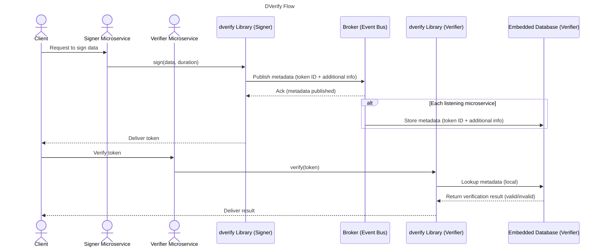

# DVerify - Multi-Language Distributed Verification Library

DVerify is a lightweight and flexible library for verifying digitally signed data. Initially developed in Java, DVerify is now available in multiple languages, making it accessible across various platforms.

## ✨ Features

- ✅ Lightweight & Fast – Minimal overhead for seamless integration.
- ✅ Supports Multiple Token Types – Primarily designed for JWTs, but adaptable.
- ✅ Ensures Secure Communication – Verifies token authenticity to prevent tampering.
- ✅ Scales with Your Microservices – Works across distributed service environments.
- ✅ Developer-Friendly API – Easy-to-use and integrates smoothly.
- ✅ Cross-language compatibility (Java, Python, Node.js, C#, Rust, Go)
- ✅ Lightweight and easy to integrate into any project

## 🌍 Advanced Use Cases

- 1️⃣ Authentication & Authorization

Validate user identities and permissions with JWTs.
Ensure only authorized users can access specific services.


- 2️⃣ Secure API Requests Between Microservices

Verify inter-service requests by validating tokens before processing.
Prevent unauthorized access to sensitive endpoints.


- 3️⃣ Token-Based Resource Access

Enable secure document downloads outside the web application (e.g., sending download links via email with token verification).
Protect API endpoints with short-lived or refreshable tokens.


- 4️⃣ Identity Verification for Decentralized Applications

Verify self-sovereign identities (SSI) using decentralized ID tokens.
Authenticate users across blockchain-based or federated identity systems.


## 🏗 Who Can Benefit?

- 👨‍💻 Developers & Architects – Simplify token authentication across microservices.
- 🏢 Organizations – Strengthen security & ensure trusted communication.
- 🔐 Cybersecurity Professionals – Implement a robust verification mechanism.

---

## Design consideration



---

## Repository Structure
```
dverify/
│── java/       # Java implementation
│── python/     # Python implementation
│── nodejs/     # Node.js implementation
│── csharp/     # C# (.NET) implementation
│── rust/       # Rust implementation
│── go/         # Go implementation
│── docs/       # Documentation
│── .github/    # CI/CD workflows
│── LICENSE
│── README.md
```

## 📦 Available Implementations

To install DVerify, follow these steps:

### Java
Visit the [Java documentation](java/README.md) for more details.

### Python (Upcoming)
A Python implementation is in development. Stay tuned!

Visit the [Python documentation](python/README.md) for more details.

### Node.js
Visit the [Node.js documentation](nodejs/README.md) for more details.

### C# (.NET) (Upcoming)
Support for .NET is planned.

Visit the [C# documentation](csharp/README.md) for more details.

### Rust (Upcoming)
A Rust-native implementation is in progress.

Visit the [Rust documentation](rust/README.md) for more details.

### Go (Upcoming)
A Go implementation is in development.

Visit tge [Go documentation](go/README.md) for more details.

---

## 🔗 Interoperability  
To ensure compatibility across programming languages, **DVerify** standardizes the broker's (e.g., Kafka) event keys and messages with the following format:  

- **Event Key:** The broker's event key is a string that represents a UUID. This guarantees uniqueness and seamless integration across diverse systems.

- **Message Pattern:** Each broker's message adheres to the following structure:  
  - `[token config] : [Base64 RSA public key] : [Expiry date seconds] : [Base64 variant]`

  **Components:**  
  - **[token config]:** Configuration details for the token. Current implementations accept either `jwt` or `uuid` as valid values.  
  - **[Base64 RSA public key]:** Encoded RSA public key, used for verifying tokens.  
  - **[Expiry date seconds]:** Specifies the expiration time in seconds, enabling automatic removal of outdated entries.  
  - **[Base64 variant]:** Represents additional data related to the `[token config]`.  
    1. For the `jwt` *token config,* this value is optional and may be omitted.  
    2. For the `uuid` *token config,* this value contains the JWT to be verified or extracted using the public key.

### Environment Variables (Optional)
The application relies on the following environment variables for configuration:

| Variable Name                     | Description                              | Default Value                                    |
|-----------------------------------|------------------------------------------|--------------------------------------------------|
| `DVER_CLEANUP_INTERVAL_MINUTES`   | Interval (in minutes) for cleanup tasks  | `60`                                             |
| `DVER_KAFKA_BOOSTRAP_SERVERS`     | Kafka bootstrap servers                  | `localhost:9092`                                 |
| `DVER_TOKEN_VERIFIER_TOPIC`       | Kafka topic for token verification       | `token-verifier`                                 |
| `DVER_EMBEDDED_DATABASE_PATH`     | Path for RocksDB storage                 | `dverify_db_data` (relative to _temp_ directory) |
| `DVER_KEYS_ROTATION_MINUTES`      | Interval (in minutes) for key rotation   | `1440` (24h)                                     |

---

## 🛠 Contributing

We welcome contributions from the community! Follow these steps:

1. Fork the repository
2. Create a feature branch

```shell
git checkout -b feature/your-feature
```

3. Commit your changes

```shell
git commit -m "Added new feature"
```

4. Push and create a pull request

```shell
git push origin feature/your-feature
```

📖 Check the [CONTRIBUTING.md](CONTRIBUTING.md) for detailed guidelines.

## 📢 Get Involved!
💬 Have feedback or ideas? Let’s build a secure and efficient token verification system together!

📌 GitHub: https://github.com/cyfko/dverify
📧 Contact: frank.kossi@sprint-pay.com

## 📜 License
This project is licensed under the MIT License. See [LICENSE](LICENSE)  file for more details.

